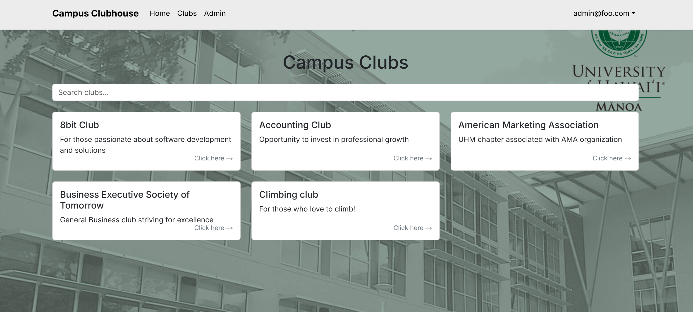
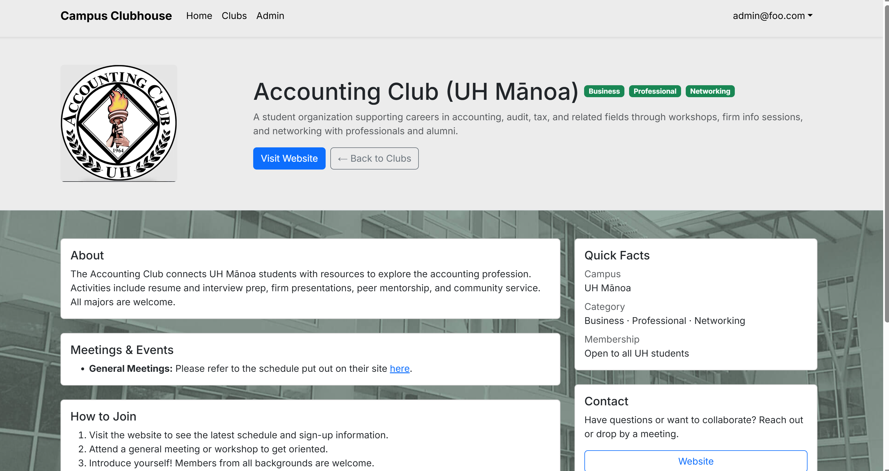
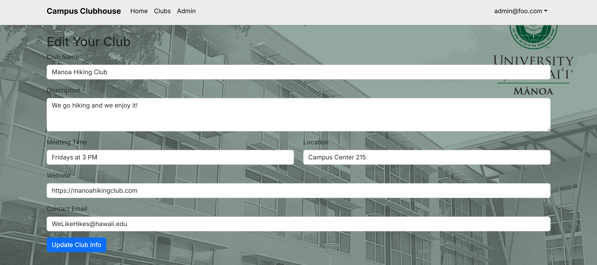
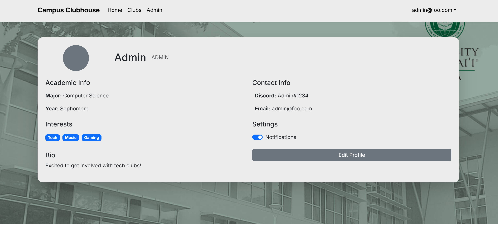

Welcome to the **Campus Clubhouse** project.

## 📚 Contents

- [Overview](#overview)
- [Deployment](#deployment)
- [Milestones](#milestones)
- [Mockup Pages](#mockup-pages)
- [Developer Guide](#developer-guide)
- [Team](#team)
- [Team Contract](#team-contract)

---

## Overview

The Problem: UH Mānoa has over 200 student clubs, both official and unofficial. However, there is no centralized and easy way for students to discover and engage with these organizations. 

The Solution: Campus Clubhouse solves this by providing a streamlined platform where students can explore, connect, and participate in campus life. It aims to create a directory where one can find any club they might want to look into and find out any relevant information about those clubs.

Features include:

- Directory of student clubs
- Club meeting times, descriptions, and contact info
- Role-based login (User, Admin, Super)

## Deployment

[🚀 https://campus-clubhouse.vercel.app/](https://campus-clubhouse.vercel.app/)


## Milestones

M1 - Project Foundation

- Layout and mockups
- Connection to database
- Core components (Navbar, Club Cards, Admin)

View on Github: [Milestone 1 Project Board](https://github.com/orgs/campus-clubhouse/projects/2)

M2 - Feature Enhancements

- Admin dashboard
- Search/filter
- Super Admin features

View on GitHub: [Milestone 2 Project Board](https://github.com/orgs/campus-clubhouse/projects/4)

M3 - Incorporating Real Data

- Create pages for existing clubs at UH Manoa
- Update Search/Filter feature to work with new added clubs

View on Github: [Milestone 3 Project Board](https://github.com/orgs/campus-clubhouse/projects/5/views/1)


## Mockup Pages

### The Landing Page is designed to be the first thing a user sees. 


### The Clubs Page harbors the different information regarding UH Manoa clubs.



## Each club page contains such as relevant information for events or who to contact


### You may also wish to see more information. By clicking the visit site button, you are redirected to learn more about that specific club.



### The Add Page is exclusively for admins wishing to post their clubs for everyone to see.


### The Edit Page is designed for admins, and super admins who may wish to edit their clubs at any time.



### The Profile Page is a fun way for users to enhance their experience.




## Developer Guide

### 🧑‍💻 Clone and Setup

```bash
git clone https://github.com/campus-clubhouse/campus-clubhouse.git
cd campus-clubhouse
npm install

## Developer Guide

This section provides more information for developers to download, install, run, and modify this code base as a basis for their own development tasks.

## Installation

First, [install PostgreSQL](https://www.postgresql.org/download/). Then create a database for your application.

```

$ createdb resources
Password:
$

```

Second, go to [https://github.com/campus-resource-scheduler-project/campus-resource-scheduler-project](https://github.com/campus-resource-scheduler-project/campus-resource-scheduler-project), and click the "Use this template" button. Complete the dialog box to create a new repository that you own that is initialized with this template's files.

Third, go to your newly created repository, and click the "Clone or download" button to download your new GitHub repo to your local file system. Using [GitHub Desktop](https://desktop.github.com/) is a great choice if you use MacOS or Windows.

Fourth, cd into the directory of your local copy of the repo, and install third party libraries with:

```

$ npm install

```

Fifth, create a `.env` file from the `sample.env`. Set the `DATABASE_URL` variable to match your PostgreSQL database that you created in the first step. See the Prisma docs [Connect your database](https://www.prisma.io/docs/getting-started/setup-prisma/add-to-existing-project/relational-databases/connect-your-database-typescript-postgresql). Then run the Prisma migration `npx prisma migrate dev` to set up the PostgreSQL tables.

```

$ npx prisma migrate dev
Environment variables loaded from .env
Prisma schema loaded from prisma/schema.prisma
Datasource "db": PostgreSQL database "<your database name>", schema "public" at "localhost:5432"

Applying migration `20240708195109_init`

The following migration(s) have been applied:

migrations/
└─ 20240708195109_init/
└─ migration.sql

Your database is now in sync with your schema.

✔ Generated Prisma Client (v5.16.1) to ./node_modules/@prisma/client in 51ms

$

```

Then seed the database with the `/config/settings.development.json` data using `npx prisma db seed`.

```

$ npx prisma db seed
Environment variables loaded from .env
Running seed command `ts-node --compiler-options {"module":"CommonJS"} prisma/seed.ts` ...
Seeding the database
Creating user: admin@foo.com with role: ADMIN
Creating user: john@foo.com with role: USER

🌱 The seed command has been executed.
$

```

## Running the system

Once the libraries are installed and the database seeded, you can run the application by invoking the "dev" script:

```

$ npm run dev

> nextjs-application-template-1@0.1.0 dev
> next dev

▲ Next.js 14.2.24

- Local: http://localhost:3000
- Environments: .env

✓ Starting...
✓ Ready in 1619ms

```

### Viewing the running app

If the construction of the website processes without error, the template application will appear at [http://localhost:3000](http://localhost:3000). You can login using the credentials in settings.development.json, or else register a new account.

### ESLint

You can verify that the code obeys standard coding standards by running ESLint over the code in the src/ directory with:

```
$ npm run lint

> nextjs-application-template-1@0.1.0 lint
> next lint

✔ No ESLint warnings or errors
$
```

### Directory structure

The top-level directory structure is:

```

.github # holds the GitHub Continuous Integration action and Issue template.

config/ # holds configuration files, such as settings.development.json

doc/ # holds developer documentation, user guides, etc.

prisma/ # holds the Prisma ORM schema and seed.ts files.

public/ # holds the public images.

src/ # holds the application files.

tests/ # holds the Playwright acceptance tests.

.eslintrc.json # The ESLint configuration.

.gitignore # don't commit VSCode settings files, node_modules, and settings.production.json

```

This structure separates documentation files (such as screenshots) and configuration files (such as the settings files) from the actual Next.js application.

The src/ directory has this structure:

```

app/

  admin/
    page.tsx # The Admin Page

  api/auth/[...nextauth]/
    route.ts # The NextAuth configuration

  auth/
    change-password/
      page.tsx # The Change Password Page

    signin/
      page.tsx # The Sign In Page

    signout/
      page.tsx # The Sign Out Page

    signup/
      page.tsx # The Sign Up / Register Page

  available-equipment/
    page.tsx # The Equipment Page

  available-rooms/
    page.tsx # The Rooms Page

  edit/
    page.tsx # The Edit User Form

  loanlink/
    page.tsx # The LoanLink Page

  not-authorized/
    page.tsx # The Not Authorized Page

  profile/
    page.tsx # The Profile Page

  resources/
    page.tsx # The Your Resources Page

  layout.tsx # The layout of the application

  page.tsx # The Landing Page

  providers.tsx # Session providers.

  components/
    AddResourceForm.tsx # The React Hook Form for adding resources.

    AvailableEquipment.tsx # The Equipment page.

    AvailableRooms.tsx # The rooms page.

    EditResourceForm.tsx # The Edit Resources Form.

    FilterSidebarEquipment.tsx # The sidebar filter for the Equipment page.

    FilterSidebarRooms.tsx # The sidebar filter for the Rooms page.

    Footer.tsx # The application footer.

    LoadingSpinner.tsx # Indicates working.

    Navbar.tsx # The application navbar.

    Popup.tsx # The Edit Profile form.

    YourResources.tsx # The Your Resources page.

  lib/

    authOptions.ts # Verifies user credentials from the database.

    dbActions.ts # Functions to manipulate the Postgres database.

    page-protections.ts # Functions to check for logged in users and their roles.

    prisma.ts # Singleton Prisma client.

    validationSchemas.ts # Yup schemas for validating forms.

  tests/ # playwright acceptance tests.

```

### Application functionality

The application implements a simple resources application for managing different resources for each user, which is a PostgreSQL table consisting of a
```
id        Int
name      String
category  String
type      String
owner     String
location  String
campus    String
image     String
posted    String
deadline  String?
```

The application also implements a PostgreSQL table for each user consisting of a
```
id       Int    
email    String 
password String
role     Role   
name     String
image    String
occupation String
bio      String
major    String
standing String
campus   String
phone    String
personal String
```

By default, each user only sees the resources that they own. However, the settings file enables you to define default accounts. If you define a user with the role "admin", then that user gets access to a special page which lists all the contacts defined by all users.

### CSS

The application uses the [React implementation of Bootstrap 5](https://react-bootstrap.github.io/). You can adjust the theme by editing the `src/app/globals.css` file. To change the theme override the Bootstrap 5 CSS variables.

```css
/* Change bootstrap variable values.
 See https://getbootstrap.com/docs/5.2/customize/css-variables/
 */
body {
  --bs-light-rgb: 236, 236, 236;
}

/* Define custom styles */
.gray-background {
  background-color: var(--bs-gray-200);
  color: var(--bs-dark);
  padding-top: 10px;
  padding-bottom: 20px;
}
```

### Routing

For display and navigation among its four pages, the application uses [Next.js App Router](https://nextjs.org/docs/app/building-your-application/routing).

Routing is defined by the directory structure.

### Authentication

For authentication, the application uses the NextAuth package.

When the database is seeded, a settings file (such as [config/settings.development.json](https://github.com/ics-software-engineering/nextjs-application-template/blob/main/config/settings.development.json)) is used to create users and contacts in the PostgreSQL database. That will lead to a default accounts being created.

The application allows users to register and create new accounts at any time.

### Authorization

Only logged in users can manipulate Contacts (but any registered user can manipulate any Contact, even if they weren't the user that created it.)

### Configuration

The config directory is intended to hold settings files. The repository contains one file: config/settings.development.json

The .gitignore file prevents a file named settings.production.json from being committed to the repository. So, if you are deploying the application, you can put settings in a file named settings.production.json and it will not be committed.


## Team

👥 Check out the developers of Campus Clubhouse here:

- [@richardkimm](https://richardkimm.github.io/)
- [@andy3-git](https://andy3-git.github.io/)
- [@deuzd](https://deuzd.github.io/)


## Team Contract

- [Link to our Contract](https://docs.google.com/document/d/1OPzpyjTgygSy5zcAOlu6pvUM5XsvgPCRtbN6FzowDhk/edit?usp=sharing)
